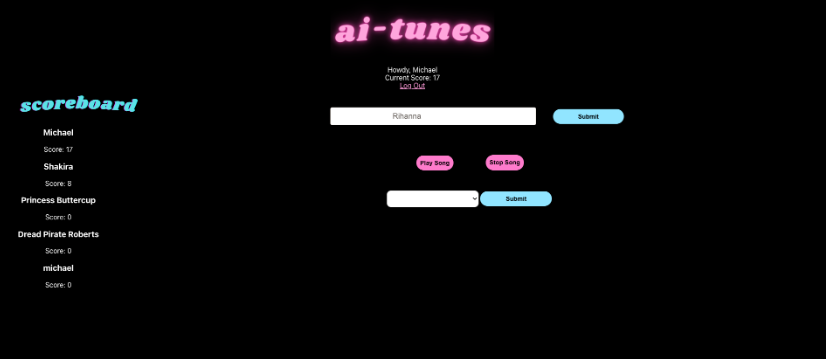
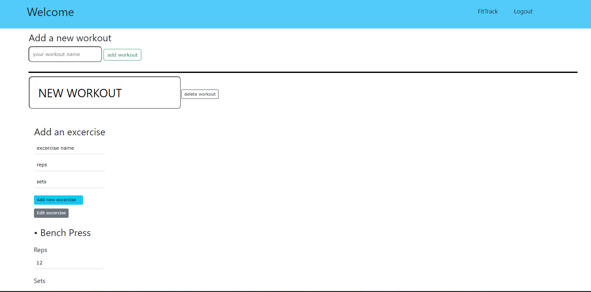
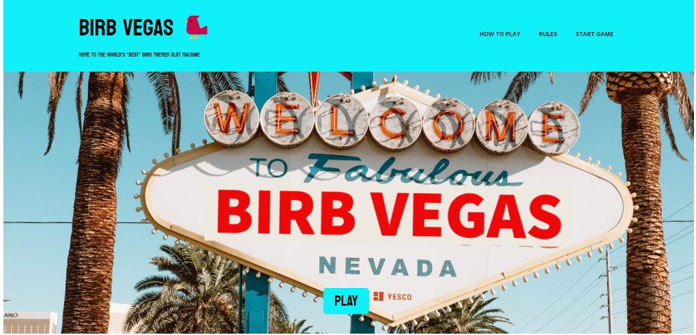

# Vaughn-Bernard

## About Me

Chemist by training, environmental protector by trade, web developer by heart, and bird lover by nature - a full stack engineer looking to make the world better, little by little.

Studying as a chemist, and working in the environmental industry for almost 5 years gave me experience and knowledge that are both irreplaceable. But after 5 years, it’s time for a change. Switching careers to software engineering, I hope to bring the same values and experiences I’ve learned to coding. Stewardship, communication, and service are just a few of the skills I’ve picked up along the way, and these skills run deep, almost as deep as my love for bird-watching. I hope to bring that with me to coding as well - somehow, someway

## Technologies I use

| React | Node |
| Express | MySQL |
| Mongoose | MongoDB |
| Django | PostgresSQL |
| Bootstrap | git |

## Languages 

| Javascript | Python |
| HTML | CSS |
| SQL | Java |

## Skills

## My Projects

Welcome to AI-Tunes. A team collaborated, full stack application utilizing the React Framework, Express, Mongoose, Node.js, and various third party API's to deliver to you a music matching party game that's fun for everyone. Select from your favorite artist and try your luck at guessing the song the AI generated voice is singing.

Shout out to Michael DiFelice and Sara Abdelbarry - Two fantastic coders/designers and team mates

Team collaborated, full stack application utilizing the MERN Infrastructure. Keep track of all of your travels using Passport! The free-to-use itinerary app that let's you keep a log of your travel destinations

One of a kind Team Mates: Ryan Beck, Akihiko Nakumura, Sara Abdelbarry, and Erm Mercedez

Log all of your fitness gains with FitTrack, the personal full-stack app that let's you log all of you exercise info and helps you keep track of all of your fitness goals. Web application utilizing vanilla JS, Express, Node, and Mongoose to deliver a fully customizable experience for fitness enthusiasts everywhere

Who needs Vegas when Vegas can come straight to your home? Who needs nature when nature can come to you? Welcome to "Birb Slots", a simple Javascript powered, in-browser video game that simulates the experience of high dollar Las Vegas Casino slot reels AND brings some of the world's coolest feathered friends to your computer.